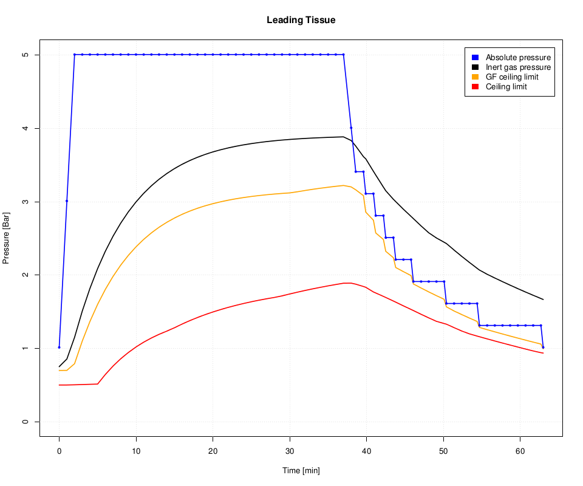
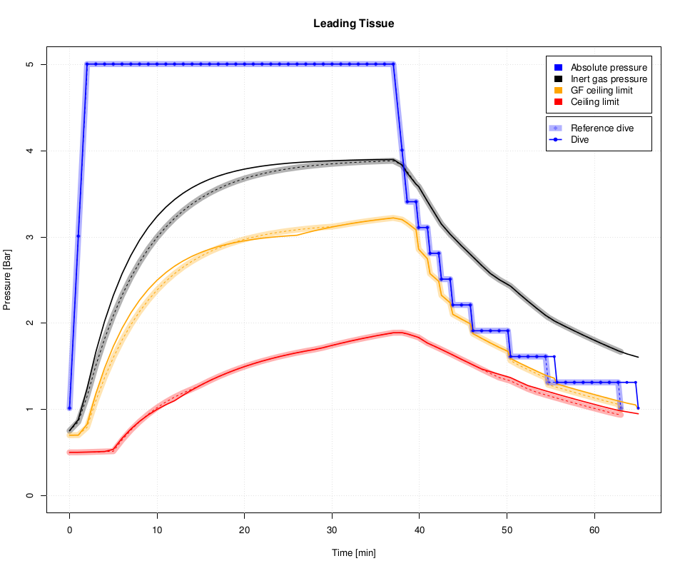

.. highlight:: rst

Commandline Tools
------------------
DecoTengu library provides two commandline applications.

The ``dt-lint`` command prints dive decompression information and allows to
store dive profile steps data in a CSV file.

The ``dt-plot`` command plots dive profile steps data in the form of PDF
file.

Calculating Dive Decompression Data
~~~~~~~~~~~~~~~~~~~~~~~~~~~~~~~~~~~
To calculate decompression information of a dive to 40m for 35 minutes on
air use the following command::

    $ dt-lint 40 35
    Dive profile:  40m for 35min
    Descent rate: 20.0m/min
    Ascent rate: 10.0m/min

    GF Low: 30%
    GF High: 85%
    Surface pressure: 1013.25 millibar

    Gas list:
     o2=21% at 0m

    Decompression stops (ZH-L16B-GF):
       21m   1min
       18m   1min
       15m   2min
       12m   5min
        9m   7min
        6m  14min
        3m  25min
    -------------
    Sum:    55min

The dive profile steps data can be saved using ``-f`` option. An example
of saving the data into ``dive.csv`` file with dive steps calculated every
minute::

    $ dt-lint -f dive.csv -t 1 -gl 20 -gh 90 -l '21,0@0 50,0@21 100,0@6' 40 35
    Dive profile:  40m for 35min
    Descent rate: 20.0m/min
    Ascent rate: 10.0m/min

    GF Low: 20%
    GF High: 90%
    Surface pressure: 1013.25 millibar

    Gas list:
     o2=21% at 0m
     o2=50% at 21m
     o2=100% at 6m

    Decompression stops (ZH-L16B-GF):
       24m   1min
       21m   1min
       18m   1min
       15m   1min
       12m   2min
        9m   4min
        6m   4min
        3m   8min
    -------------
    Sum:    22min

Plotting Dive Decompression Data
~~~~~~~~~~~~~~~~~~~~~~~~~~~~~~~~
Once dive profile steps data is saved in a CSV file, the dive profile can
be plotted with ``dt-plot`` command::

    $ dt-plot dive.csv dive.pdf

The output, PDF file, contains plots for each of 16 tissues described by
Buhlmann model

- first page contains summary for each tissue compartment
- second page has plot for leading tissue compartment data (presented on
  figure :ref:`cmd-plot-leading-tissue`)
- next pages contain plots for each tissue compartment

The plots show pressure value at given time of a dive. There are four lines
on the plot

blue
    Pressure of dive depth.
black
    Pressure of inert gases in a tissue compartment.
orange
    Tissue pressure ceiling limit as implied by current gradient factor
    value. For example, when GF low set to 30% and GF high set to 90%,
    gradient factor value is 30% until first decompression stop and then it
    changes lineary to 90% until the surface.
red
    The maximum tissue pressure limit as required by Buhlmann model (or at
    100% gradient factor value).

.. _cmd-plot-leading-tissue:

   Leading tissue data plot

Comparing Dive Decompression Data
~~~~~~~~~~~~~~~~~~~~~~~~~~~~~~~~~
The ``dt-plot`` script allows to compare two dive profiles, i.e. to
visualize differences between two decompression models, decompression model
parameters or various gas mix configurations.

For example, to compare two dive profiles for ZH-L16B-GF and ZH-L16C-GF
decompression models::

    $ dt-lint -f dive.csv -t 60 -gl 20 -gh 90 -l '21,0@0 50,0@21 100,0@6' 40 35
    $ dt-lint -f dive-c.csv -m zh-l16c-gf -t 60 -gl 20 -gh 90 -l '21,0@0 50,0@21 100,0@6' 40 35
    $ dt-plot dive.csv dive-c.csv dive.pdf

.. _cmd-plot-leading-tissue-cmd:

   Comparison of leading tissue data between ZH-L16B-GF and ZH-L16C-GF

.. vim: sw=4:et:ai
